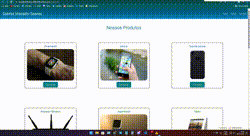

<h1>Site Flexbox - Gabriel</h1>

Nunca desista dos seus sonhos! 💪

## 🚨Sobre

O projeto **"Site Flexbox - Gabriel"** foi feito para aplicar os meus estudos em um site prático, onde pela primeira vez apliquei responsividade e o uso de flexbox para posicionar os elementos do site.

<h1><a a href="https://gabrielflexbox.netlify.app/" target="_blank">Acesse o site aqui</a></h1>

## ⚙️Ferramentas Utilizadas no projeto

- HTML
- CSS
